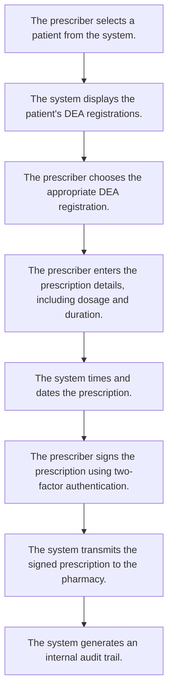

# Process workflow — Prescribing a Controlled Substance Prescription

Derived from the main success scenario of the first use case.

```mermaid
flowchart TD
    S0["The prescriber selects a patient from the system."]
    S1["The system displays the patient's DEA registrations."]
    S0 --> S1
    S2["The prescriber chooses the appropriate DEA registration."]
    S1 --> S2
    S3["The prescriber enters the prescription details, including dosage and duration."]
    S2 --> S3
    S4["The system times and dates the prescription."]
    S3 --> S4
    S5["The prescriber signs the prescription using two-factor authentication."]
    S4 --> S5
    S6["The system transmits the signed prescription to the pharmacy."]
    S5 --> S6
    S7["The system generates an internal audit trail."]
    S6 --> S7
```
