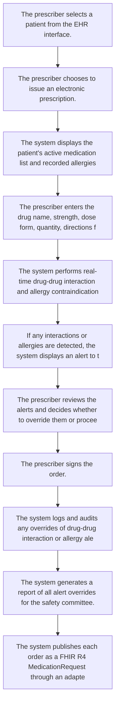

# Process workflow — Issuing an Electronic Prescription with Real-Time Interaction and Allergy Checks

Derived from the main success scenario of the first use case.

```mermaid
flowchart TD
    S0["The prescriber selects a patient from the EHR interface."]
    S1["The prescriber chooses to issue an electronic prescription."]
    S0 --> S1
    S2["The system displays the patient's active medication list and recorded allergies "]
    S1 --> S2
    S3["The prescriber enters the drug name, strength, dose form, quantity, directions f"]
    S2 --> S3
    S4["The system performs real-time drug-drug interaction and allergy contraindication"]
    S3 --> S4
    S5["If any interactions or allergies are detected, the system displays an alert to t"]
    S4 --> S5
    S6["The prescriber reviews the alerts and decides whether to override them or procee"]
    S5 --> S6
    S7["The prescriber signs the order."]
    S6 --> S7
    S8["The system logs and audits any overrides of drug-drug interaction or allergy ale"]
    S7 --> S8
    S9["The system generates a report of all alert overrides for the safety committee."]
    S8 --> S9
    S10["The system publishes each order as a FHIR R4 MedicationRequest through an adapte"]
    S9 --> S10
```
