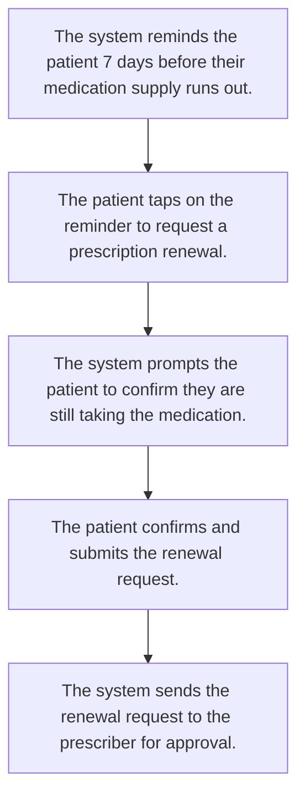

# Process workflow — Patient Requests Prescription Renewal

Derived from the main success scenario of the first use case.

```mermaid
flowchart TD
    S0["The system reminds the patient 7 days before their medication supply runs out."]
    S1["The patient taps on the reminder to request a prescription renewal."]
    S0 --> S1
    S2["The system prompts the patient to confirm they are still taking the medication."]
    S1 --> S2
    S3["The patient confirms and submits the renewal request."]
    S2 --> S3
    S4["The system sends the renewal request to the prescriber for approval."]
    S3 --> S4
```
