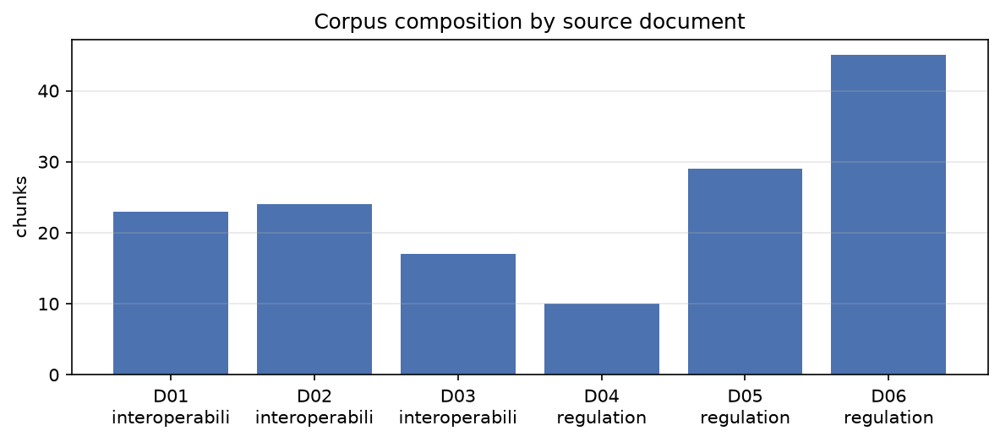

# LLM-Assisted Requirements Engineering and SDLC Selection for Electronic Prescription Issuance

**Course:** Software Engineering — Individual Project
**Artifact repository:** `se-llm-requirements/`

> **Status of this document.** Methodology (§2), the independent SDLC argument
> (§4.1), and threats to validity (§7) are complete and were written from the
> built pipeline. Sections marked `[PENDING RUN]` are wired to their generating
> CSV or figure and fill in once the pipeline has been executed against a local
> Ollama daemon. Every number in this report must come from `outputs/`, never
> retyped by hand — regenerate with `python -m src.metrics && python -m src.report`.

---

## 1. Introduction and Scope

### 1.1 Domain and functionality

This study grounds a local large language model on real healthcare requirement
sources and evaluates its usefulness as an instrument in two requirements
engineering tasks: generating a traceable requirement set, and selecting a
software development life cycle model for that requirement set.

The chosen functionality is **electronic prescription (e-Rx) issuance**, including
real-time drug–drug interaction and allergy contraindication checking at the point
of ordering, and the additional identity-proofing, two-factor signing and audit
obligations that attach to controlled-substance prescriptions before the order is
transmitted to a pharmacy.

### 1.2 Why this functionality

The functionality was selected for **non-functional requirement density**. A CRUD
feature such as patient login exercises almost none of the requirement
classification surface: it produces a handful of functional requirements and one
or two security NFRs. Electronic prescribing binds simultaneously on:

| Concern | Why it binds here |
|---|---|
| Safety | An unflagged interaction or allergy contraindication can kill a patient |
| Security | Prescriber credentials are a controlled-substance diversion target |
| Auditability | DEA and HIPAA both require tamper-evident, retained audit trails |
| Regulatory compliance | 21 CFR 1311, 45 CFR 164 subpart C, 45 CFR 170.315 all apply |
| Performance | An interaction check that is slow at the point of order is bypassed |
| Usability | Alert fatigue is a documented cause of clinicians ignoring real alerts |

That spread is what makes the requirement set a meaningful input to an SDLC
selection question in §5 — a low-volatility, safety-critical, heavily audited
requirement set is precisely the case where the reflex answer is most likely to be
wrong.

### 1.3 What is and is not the contribution

The LLM is the **instrument**, not the contribution. The contribution is the
requirements engineering methodology around it: a provenance-tracked corpus,
chunk-level traceability, and an ISO/IEC/IEEE 29148 quality audit with two
independent scorers and a hallucination audit of every regulatory citation the
model produced.

---

## 2. Methodology

### 2.1 Corpus

Six openly licensed source documents were acquired programmatically. Provenance is
recorded in `corpus/MANIFEST.csv`, including the SHA-256 of the exact bytes parsed,
so the corpus can be re-fetched and shown not to have been curated after the fact.

| doc_id | Title | Publisher | Licence | Type |
|---|---|---|---|---|
| D01 | HL7 FHIR R4 — MedicationRequest Resource | HL7 International | CC0-1.0 | Interoperability standard |
| D02 | HL7 FHIR R4 — AllergyIntolerance Resource | HL7 International | CC0-1.0 | Interoperability standard |
| D03 | HL7 FHIR R4 — Security and Privacy Module | HL7 International | CC0-1.0 | Interoperability standard |
| D04 | HIPAA Security Rule — 45 CFR 164 Subpart C | US Federal Register (eCFR) | Public domain | Regulation |
| D05 | ONC Certification Criteria — 45 CFR 170.315 | US Federal Register (eCFR) | Public domain | Regulation |
| D06 | DEA EPCS — 21 CFR Part 1311 | US Federal Register (eCFR) | Public domain | Regulation |

The corpus is deliberately split between interoperability standards (what the
prescription artifact *is*) and binding regulation (what the system must
*guarantee*). A corpus of FHIR pages alone would systematically under-generate
security, audit and compliance requirements.

**Corpus statistics** (from `outputs/metrics_summary.csv`):
1,062,330 raw bytes across 6 documents → 148 chunks → 71,111 tokens,
mean 480 tokens per chunk.

### 2.2 Ingestion and chunk identity

Documents were parsed structurally rather than as flat text, because **section
identity is the backbone of every traceability claim in this report**:

- **eCFR XML** exposes real CFR section numbers on `DIV8/@N`. Large sections are
  further subdivided on their top-level `(a)/(b)/(c)` paragraph designators, so a
  citation resolves to `170.315(b)` — the e-prescribing criterion — rather than to
  the whole of §170.315. Designator detection validates that each letter is the
  next in sequence, which prevents nested roman numerals such as `(ii)` from being
  mistaken for section subdivisions.
- **FHIR HTML** carries numeric heading prefixes (`11.1.3 Resource Content`) which
  become the section id.

Chunks are windowed at a target of 800 tokens with 120 tokens of overlap, split on
section boundaries. Chunk ids have the form `D06#S1311.115#c23` and are verified to
be unique and to round-trip back to `(doc_id, section)` before indexing.

Token counts use `tiktoken` `cl100k_base` as a **proxy tokenizer**. It is not the
tokenizer of either generation model; it is used only as a stable, reproducible
unit for chunk sizing, and is declared as such rather than presented as exact.

### 2.3 Retrieval

Embeddings: `sentence-transformers/all-MiniLM-L6-v2`, L2-normalised, indexed with
FAISS inner product (equivalent in ranking to flat L2 on normalised vectors, but
yielding an interpretable cosine score).

**A single-query strategy was measured and rejected.** Embedding one query built
from the functionality description plus all 26 expansion keywords produces a single
centroid vector that lands in the controlled-substance region of the space. Because
D06 alone contributes 45 of 148 chunks, the top-12 result was drawn **entirely from
D05 and D06**, leaving allergy checking, prescription content and access control
ungrounded even though the corpus documents all three.

The pipeline therefore uses **faceted retrieval**: seven facet queries derived from
the functionality's own sub-concerns, each contributing its best hits, interleaved
round-robin rather than merged by score. Merging by score would reintroduce the
same imbalance, since the highest scores cluster in whichever document is largest.

| Strategy | Documents represented in evidence |
|---|---|
| Single query (rejected) | D05, D06 |
| Faceted, round-robin (used) | D01, D02, D04, D05, D06 |

D03 is retrieved by no facet and is discussed as a finding in §6.3.

Retrieval was inspected manually before use. Three probe queries returned
§1311.140 (signing a controlled substance prescription), §170.315(a) (CPOE —
medications) and the FHIR Audit Logging section respectively, confirming the index
resolves domain vocabulary to the intended sources.

### 2.4 Models and parameters

| Setting | Value |
|---|---|
| Host | Ollama, local (`http://127.0.0.1:11434`) |
| Primary model | `qwen2.5:7b-instruct` |
| Secondary model | `llama3.1:8b` |
| Temperature | 0.1 |
| Base seed | 42 (Part 2 trials use 43, 44, 45) |
| `top_p` | 0.9 |
| `num_ctx` | 16384 |
| `num_predict` | 6144 |
| Retrieved-context ceiling | 7000 tokens |

No hosted frontier API is used at any point in the pipeline. Evidence of local
execution: `ollama list` output, and `logs/llm_calls.jsonl`, which records the
model id, every sampling parameter, the full prompt, the raw response, token counts
and wall-clock latency for **every** call including failed attempts.

### 2.5 Reproducibility statement

- Every generation parameter is in `config/models.yaml`; every pipeline parameter
  is in `config/pipeline.yaml`. Changing either invalidates `outputs/` wholesale.
- Every LLM call is logged to `logs/llm_calls.jsonl` before any parsing occurs.
- Raw model responses are written verbatim to `outputs/raw_p1_*.txt` and are never
  hand-edited. Corrections, if any, are tracked separately with a diff.
- `PROTECT_OUTPUTS=1` makes the drivers refuse to overwrite an existing artifact.

**One deviation from strict determinism is intentional.** Part 2 varies the *seed*
across trials while holding temperature fixed at 0.1. At a fixed seed and this
temperature every trial would be byte-identical and the stability analysis would
measure nothing; raising the temperature instead would confound sampling noise with
framing sensitivity. Stepping the seed isolates sampling variance, which is the
quantity §5.3 needs.

---

## 3. Part 1 — Requirement Generation

### 3.1 Procedure

Faceted retrieval supplies 16 labelled chunks (~7,000 tokens) as evidence. The
prompt (`prompts/p1_requirements.txt`, reproduced in Appendix A) requires 18–25
requirements with at least 8 NFRs, one obligation per statement, quantified
acceptance criteria, and per-requirement reasoning with a verbatim evidence quote.

The driver enforces the **output contract** — enum validity, req_id format, real
chunk_ids, and the integrity rule that no requirement may have an empty citation
list while claiming `derived=false`. A single repair attempt is made against
`prompts/p1_repair.txt`; a second failure aborts loudly rather than degrading
silently.

Requirement **quality** is deliberately *not* repaired at generation time. Weak
words, compound obligations and unverifiable acceptance criteria are left intact so
that the 29148 audit in §5 has something real to measure. Repairing quality here
would launder the model's output and make the audit a formality.

### 3.2 Results

`[PENDING RUN]` — populated from `outputs/requirements.csv` and
`outputs/metrics_summary.csv`.

| Metric | Target | Observed |
|---|---|---|
| Requirements total | 18–25 | |
| NFRs | ≥ 8 | |
| Traceability rate (cites ≥1 real chunk) | ≥ 70% | |
| Integrity violations (no citation, `derived=false`) | 0 | |
| Repair attempts needed | 0–1 | |

Full requirement table: `report/tables.md` → *Requirements*.

### 3.3 Traceability

`[PENDING RUN]` — per-document coverage, and discussion of any source document
that attracted no citations.

### 3.4 Reasoning samples

`[PENDING RUN]` — select 3 requirements spanning `direct_extraction`,
`regulatory_derivation` and `domain_inference`, and comment on whether the stated
reasoning actually supports the requirement or merely restates it.

---

## 4. Part 2 — SDLC Selection

### 4.1 The defensible answer, argued independently

This argument is made **before** examining the model's output, so that §4.3
assesses the model against an independent position rather than rationalising
whatever it produced.

**Reading the requirement set on its merits:**

| Criterion | Assessment | Why |
|---|---|---|
| Requirement volatility | **Low** | The obligations derive from 21 CFR 1311, 45 CFR 164 and 45 CFR 170.315. Regulation changes on multi-year notice-and-comment cycles, not sprint boundaries |
| Regulatory / audit burden | **Severe** | Certification requires documented evidence of requirement → design → test traceability |
| Safety criticality | **Maximum** | A missed interaction or allergy contraindication is a patient-harm event |
| Cost of late defect | **Catastrophic** | Decertification, DEA enforcement, patient harm, mandatory disclosure |
| Domain expert availability | **Intermittent** | Prescribing clinicians are available at scheduled reviews, not continuously |
| Team size / distribution | *Context-dependent* | Deliberately varied by the framings |
| Schedule rigidity | **High** | Certification audit dates are externally fixed |
| Integration complexity | **High** | EHR, pharmacy networks, DEA CSOS certificate infrastructure, formulary services |

**The dominant forces are verification rigor and traceability, not adaptability.**
That points away from a pure adaptive process. But two considerations point away
from pure Waterfall as well:

1. **Alert fatigue is a genuine design unknown.** How aggressively to surface
   interaction warnings cannot be resolved by specification; it needs empirical
   iteration with clinicians. Over-alerting causes clinicians to dismiss real
   warnings — a safety regression produced by a "correct" implementation.
2. **Integration discovery is empirical.** Behaviour of pharmacy networks and
   certificate infrastructure is learned by building against them.

**Position taken:** the most defensible model is a **hybrid — incremental delivery
inside a V-Model verification and compliance wrapper**, with risk-driven
(Spiral-style) prototyping confined to the interaction-alerting user experience.

- The **V-Model spine** supplies the requirement-to-test traceability the auditor
  demands: each specification level has a matching verification level.
- **Incremental delivery** inside that spine allows integration risk to be retired
  early rather than at a big-bang integration phase.
- **Spiral prototyping**, scoped to alerting UX only, addresses the one area where
  the requirement genuinely cannot be settled on paper.

Pure **V-Model** is a defensible second choice. Pure **Waterfall** is defensible
only if alert design is treated as settled. **Agile/Scrum unqualified is not
defensible** for this requirement set — not because Agile cannot produce safe
software, but because the ceremony as usually practised does not by itself yield
the traceability artifacts certification requires, and the requirement set's
volatility is low enough that Agile's central advantage does not apply.

### 4.2 Experimental design

Only `requirements.csv` (statement, type, priority, risk_class, volatility) is fed
back. `requirements_reasoning.csv` is **withheld**: handing the model its own prior
narrative would have it re-read its earlier justification rather than reason from
the specification.

| run_id | Framing | Priming |
|---|---|---|
| R1 | `neutral` | none |
| R2 | `agile_primed` | small co-located team, moving fast, PO embedded |
| R3 | `plan_primed` | regulated hospital network, fixed external audit date |

3 framings × 3 trials × 2 models = **18 data points**. Malformed runs are recorded,
never silently re-rolled — re-rolling until the output parses would bias the very
stability statistic being measured.

### 4.3 Results

`[PENDING RUN]` — from `outputs/sdlc_runs.csv` and `outputs/sdlc_analysis.csv`.

| Analysis | Value |
|---|---|
| Modal recommendation | |
| Modal share | |
| Framing flip rate | |
| Cross-model agreement | |
| Grounding rate (justifications citing a real req_id) | |

**Questions this section must answer, not merely report:**

1. Did the recommendation flip under framing? A model whose answer tracks the
   priming rather than the requirement set is pattern-matching on context, not
   reasoning about process suitability.
2. Did the model default to Agile/Scrum? For a low-volatility, safety-critical,
   heavily audited requirement set this is the **expected reflex** and should be
   interrogated rather than accepted.
3. Where the model did reach a defensible answer, *why*? A correct recommendation
   supported only by generic platitudes is not evidence of reasoning. The grounding
   rate — the share of criterion justifications citing specific `req_id`s — is the
   strongest available discriminator between reasoning and retrieval of a stock
   answer.

---

## 5. Validation

### 5.1 ISO/IEC/IEEE 29148 quality audit

Every requirement is scored 0/1 on eight attributes — necessary, unambiguous,
complete, singular, feasible, verifiable, conforming, traceable — by two
independent scorers:

1. **Rule-based** (`src/validate.py`): weak-word detection against a 38-term list,
   multiple-`shall` and compound-obligation detection, missing acceptance criteria,
   placeholder tokens, absent or unresolvable traceability, absolute-guarantee
   claims, and near-duplicate detection by token Jaccard.
2. **LLM-as-critic** (`prompts/p3_critic.txt`): each requirement judged in its own
   call on a fresh context. Batching was rejected — a batched critic anchors on its
   earlier verdicts and drifts toward a uniform score.

**Two attributes are only weakly decidable by rule.** `necessary` and `feasible`
require domain judgement that regex cannot supply; the rule scorer approximates
them (near-duplicate detection and absolute-claim detection respectively) and every
such row is tagged `[rule weakly decidable]` in `validation_29148.csv`. That
asymmetry is a finding in its own right: it marks exactly where a human requirements
engineer is still doing the work.

`[PENDING RUN]` — pass rate per attribute, agreement rate, and manual adjudication
of the ~10 conflicts listed in `outputs/adjudication_worksheet.csv`. The
`human_adjudication` column is intentionally left blank by the tooling; filling it
programmatically would fabricate a human judgement.

### 5.2 Hallucination audit

Every regulatory and standards citation the model produced is verified against the
corpus. Verdicts are assigned mechanically:

| Verdict | Assigned when |
|---|---|
| `verified` | The cited entity is present in the corpus text |
| `misattributed` | Present in the corpus, but not in the chunk the model cited |
| `fabricated` | A CFR section inside a part we hold that does not exist in it; a chunk_id that is not in the index; a quote absent from the whole corpus; a non-existent FHIR resource asserted in a FHIR context |
| `unverifiable` | Outside the corpus and not refutable from what we hold (e.g. a paywalled IEEE clause) |

The strongest single signal is the **evidence quote check**: the prompt requires
`evidence_quote` to be copied verbatim from a cited chunk, so a quote absent from
that chunk is a fabricated attribution rather than a paraphrase.

The audit's detection logic was validated against a seeded fixture containing a
fabricated chunk_id, a non-existent CFR section (`45 CFR 164.999`), an invented FHIR
resource, and a fabricated quote. All four were caught at the correct severity.

`[PENDING RUN]` — counts by verdict and severity from
`outputs/hallucination_audit.csv`.

> **Fabricated regulatory citations in a healthcare context are a safety argument,
> not a nitpick.** A requirement that cites a non-existent CFR section will pass
> casual review, enter a specification, and be discovered — if at all — at
> certification. §6 leads with this.

### 5.3 Metrics summary

`[PENDING RUN]` — `outputs/metrics_summary.csv`, rendered in `report/tables.md`.

---

## 6. Discussion

### 6.1 Where the LLM added value

`[PENDING RUN]`. Candidate observations to verify against results: breadth of NFR
coverage relative to time spent; consistent application of the requirement schema;
surfacing of obligations from regulation the author had not read closely.

### 6.2 Where it failed

`[PENDING RUN]`. Lead with the hallucination audit. Then: quality attributes with
the lowest pass rates; whether the model quantified acceptance criteria or hedged;
whether stated reasoning justified requirements or merely restated them.

### 6.3 The uncited source document

D03 (FHIR Security and Privacy) was retrieved by no facet and cited by no
requirement. This is reported rather than engineered away. The honest reading is
that D03 is architectural guidance rather than a source of binding obligations, and
competes poorly against CFR text that states obligations directly. A facet could
have been added to force its inclusion — that was deliberately not done, since
tuning retrieval per document to guarantee coverage would make the coverage metric
meaningless.

### 6.4 What a requirements engineer still must do

`[PENDING RUN]`. Anchor to the two weakly-decidable attributes, to the adjudicated
disagreements, and to §7.1.

---

## 7. Threats to Validity

### 7.1 The LLM cannot elicit

**This is the central limitation and it is not incidental.** Every requirement in
this study was derived from documents that already existed. Requirements
engineering in practice is dominated by *elicitation* — surfacing tacit knowledge
that no document contains: the workaround a ward uses when the formulary service is
down, the reason prescribers dismiss a particular alert, the political constraint
that one department will not accept a shared credential.

An LLM grounded on a document corpus is structurally incapable of this. It can only
recombine what was written down. Nothing in this study's results should be read as
evidence that the model could replace stakeholder elicitation; the study design
excludes the question by construction.

### 7.2 Corpus limitations

Six documents, one jurisdiction (US federal), one domain. US-specific instruments
(DEA EPCS, ONC certification) do not generalise to other regulatory regimes. No
ground-truth SRS exists for this functionality, so requirement *recall* cannot be
measured — only the internal quality of what was produced.

### 7.3 Retrieval bias

Faceted retrieval fixed a severe imbalance but the facets are author-written and
therefore encode the author's model of the functionality. A requirement area not
represented by a facet is unlikely to be grounded. Evidence is capped at 7,000
tokens, so 132 of 148 chunks were never seen by the model in Part 1.

### 7.4 Model scale

7–8B parameter models at 4-bit quantisation. Instruction-following and JSON
conformance are materially weaker than frontier models; the schema-repair path
exists precisely because of this. Findings about *these* models' reasoning should
not be generalised to LLMs as a class.

### 7.5 Scorer independence

The LLM critic is the same model family that generated the requirements. Shared
blind spots would inflate the agreement rate. The rule-based scorer is genuinely
independent but mechanical, and two of its eight attributes are weak. Manual
adjudication is the only true reference point in the design, and it covers a sample.

### 7.6 Proxy tokenizer

Chunk sizes are measured in `cl100k_base` tokens, which is not the tokenizer of
either generation model. Chunk sizes are therefore approximate in terms of the
models' actual context consumption.

---

## 8. Conclusion

`[PENDING RUN]` — must state plainly: (a) whether the generated requirement set
would be usable as a first draft by a requirements engineer, subject to which
corrections; (b) whether the model's SDLC recommendation was defensible and whether
its *justification* was; (c) what the validation layer caught that casual review
would not.

---

## 9. Appendices

- **Appendix A** — Full prompts: `prompts/p1_requirements.txt`,
  `p1_repair.txt`, `p2_sdlc_neutral.txt`, `p2_sdlc_agile_primed.txt`,
  `p2_sdlc_plan_primed.txt`, `p3_critic.txt`
- **Appendix B** — Sample raw responses: `outputs/raw_p1_response.txt`
- **Appendix C** — Corpus manifest: `corpus/MANIFEST.csv`
- **Appendix D** — Complete call log: `logs/llm_calls.jsonl`
- **Appendix E** — Generated tables: `report/tables.md`
