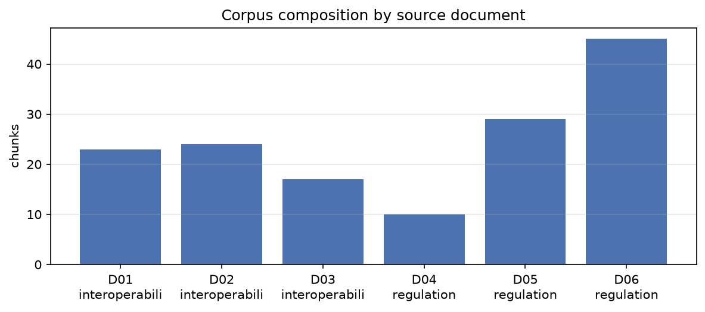

# An Agentic LLM System for Requirement Gathering, Analysis and SDLC Identification — Healthcare e-Prescribing

**Course:** Software Engineering — Individual Project
**Artifact repository:** `se-llm-requirements/`

> **Status of this document.** The problem framing (§1), system design (§2),
> methodology (§3), evaluation design (§4), the independent SDLC argument (§6.2) and
> threats to validity (§9) are complete and were written from the built system.
> Sections marked `[PENDING RUN]` fill in from the generated outputs once the pipeline
> has run on a GPU (`notebooks/run_on_colab.ipynb`); each names the files it draws on.
> Every number must come from `outputs/` or `report/tables.md`, never retyped by hand —
> regenerate with `python -m src.evaluate --case all && python -m src.metrics &&
> python -m src.report`.

---

## 1. Problem and Scope

### 1.1 The problem

Requirements for regulated, security-sensitive software come from many parties —
clinicians, pharmacists, patients, compliance and security officers, architects,
auditors, regulators, legacy systems and policy documents — and arrive as unstructured
natural language. Gathering and analysing them by hand is slow and prone to ambiguity,
inconsistency, regulatory omissions and weak stakeholder alignment, which leads to wrong
scope, an unsuitable development process, compliance gaps and rework.

This project designs and builds an **agentic LLM system** that interviews stakeholders,
analyses their statements and the project documents, asks clarification questions,
detects incomplete and conflicting requirements, turns validated input into structured
functional and non-functional requirements with traceability, maps them to regulations
and controls, and recommends a justified, project-specific SDLC — with evidence, audit
trails and human approval at every point where a decision carries accountability.

### 1.2 Domain

The problem statement is written for the financial sector. This project applies it to
**healthcare e-prescribing**, which has the same defining properties — heavy regulation
(HIPAA Security Rule, ONC certification, DEA controlled-substance rules), sensitive
personal data (protected health information), security threats, legacy integration, and
severe consequences of failure (patient harm) — and for which openly licensed,
machine-readable regulation and interoperability standards exist.

### 1.3 Case studies

| Case | Functionality | Character |
|---|---|---|
| `erx_issuance` | E-prescription issuance with drug-drug and drug-allergy checking | Safety-critical, heavily regulated, low volatility |
| `epcs_signing` | Controlled-substance prescribing: identity proofing, two-factor signing, access control, audit | Regulation- and security-dominated, fixed audit date |
| `refill_reminders` | Patient app: refill reminders and renewal requests | Lower clinical risk, UX-driven, volatile, continuously delivered |

The three differ in the characteristics that drive SDLC selection, so the SDLC engine is
tested on cases whose right answers are not all the same.

### 1.4 What is and is not the contribution

The LLMs are instruments. The contribution is the requirements-engineering system around
them: a multi-agent process that mirrors RE practice, grounding in a provenance-tracked
knowledge base, chunk- and statement-level traceability, a 29148 quality audit with two
independent scorers, a hallucination audit, a transparent SDLC decision engine, security
controls around the model, human approval gates — and an evaluation that measures all of
it against gold standards and a single-prompt baseline.

---

## 2. System Design

The design follows the problem statement's twenty points; `BUILD.md` Part B maps each
point to its code.

### 2.1 Outputs

Per case: a Software Requirements Specification, user stories with Gherkin acceptance
scenarios, use cases and a process workflow, data and interface requirements, a
compliance-control matrix, a threat register and a risk register, a requirements
traceability matrix, an assumptions and dependencies register, an open-issues list, and
a ranked SDLC recommendation with a tailored workflow.

### 2.2 Stakeholders and interview templates

Ten roles — prescriber, pharmacist, patient, clinical safety officer, compliance officer,
security officer, architect, product owner, operations, auditor — each with a
role-specific interview template (`config/stakeholders.yaml`) covering the thirteen topic
areas the brief lists: objectives, users and roles, the current workflow, inputs, outputs
and rules, exceptions, data collection and retention, authentication and authorisation,
prescribing limits, audit, performance and availability, integration, regulatory and
security constraints, schedule and budget.

### 2.3 Inputs and data protection

Interviews and documents — meeting notes, emails, policies, legacy interface
specifications and incident reports. Before any agent sees them, every text is
**masked** (patient names, MRNs, dates of birth, DEA numbers and NPIs confirmed by check
digit, phone numbers, e-mail addresses) and **screened for prompt injection**; the
original identifiers go to a vault that is encrypted at rest and can be re-identified
only by the privacy or compliance officer role.

### 2.4 Multi-agent architecture

| Agent | Responsibility |
|---|---|
| Coordinator | Execution order, shared state, approval gates, checkpoints |
| Stakeholder interaction | Adaptive interviews; follow-ups on weak answers |
| Requirement extraction | Structured requirements from statements, grounded in retrieved evidence |
| Clarification | Returns failing requirements to their stakeholders |
| Classification | Multi-label classification into 13 categories |
| Conflict detection | Duplicates and contradictions |
| Compliance | Control mappings, gaps, gap proposals |
| Security and privacy | STRIDE threats; requirements for unmitigated threats |
| Risk analysis | Risk register |
| SDLC selection | Decision factors → rules + MCDA → workflow |
| Documentation | SRS and artefacts |
| Validation | 29148 audit, hallucination audit, confidence |
| Human approval | Routes decisions to authorised roles |

The coordinator runs fourteen steps — intake, interviews, extraction, classification,
conflicts, first-draft quality, clarification, compliance, security and privacy, risk,
validation, SDLC, documentation, approval — over a shared **blackboard**. Each agent
reads and writes only the keys its permissions name (`config/pipeline.yaml`); anything
else raises and is logged as a security event. The blackboard is checkpointed after
every step, so an interrupted run resumes where it stopped.

### 2.5 Knowledge base

The authorised knowledge base is version-controlled and every item carries its source,
jurisdiction, effective date, version and applicability: six source documents
(`corpus/MANIFEST.csv`, with SHA-256), a catalogue of 45 compliance and security
controls each resolved to a section of those documents (`config/controls.yaml`), the SDLC
factors, rules, profiles and workflow templates (`config/sdlc.yaml`), and the interview
templates. Each run records a fingerprint of all of it.

### 2.6 Retrieval-grounded generation

Extraction retrieves evidence from the case's allowlisted sources with faceted queries
(§3.3); a requirement cites the chunks that support it and copies a verbatim evidence
quote. Citations to chunks the model was not shown are recorded as invalid. Each
requirement gets a confidence score from its evidential support and its 29148 quality;
unsupported and low-confidence requirements are escalated for human review.

### 2.7 Adaptive interviews

Round one asks role-specific questions adapted to the case. Round two follows up on
answers that are vague, incomplete or inconsistent: rule checks flag weak wording and
missing numbers on quantitative topics, and every flagged answer gets a follow-up.

### 2.8 Requirement structure

Id (`FR-ERX-001`), statement, categories, source stakeholder statements, business
justification, priority, dependencies, assumptions, acceptance criteria, verification
method, applicable regulations and controls, risk level, confidence, approval status,
version and origin.

### 2.9 Classification

Multi-label, over business, stakeholder, functional, security, privacy, regulatory,
performance, availability and reliability, usability, data management, integration,
audit and reporting, and operational requirements. A deterministic keyword classifier
backs the model up and its labels are kept for comparison.

### 2.10 Quality analysis and clarification

The 29148 rule scorer checks each requirement for ambiguity, incompleteness,
non-singularity, untestability, missing source, infeasibility, duplication and
non-conformance; an acronym check flags undefined terminology; the conflict agent flags
contradictions; the compliance agent flags security, privacy or regulatory requirements
with no control. Requirements with clarifiable findings go back to their stakeholders
for up to two rounds, and the extraction agent revises them from the answers. Quality is
recorded before and after clarification.

### 2.11 Compliance and security analysis

The compliance agent proposes, for each requirement, the controls it satisfies, each
backed by evidence from the control's own section; it then lists the applicable controls
nothing covers and proposes a requirement for each. It never makes a legal
determination: every mapping and proposal is queued for the compliance officer. The
security and privacy agent threat-models the functionality with STRIDE and proposes
requirements for unmitigated threats.

### 2.12 SDLC decision factors and engine

Two models score the brief's thirteen factors — requirement instability, regulatory
criticality, security risk, complexity, size, legacy dependence, change frequency, need
for continuous delivery, stakeholder availability, documentation and testing
requirements, budget and schedule constraints, need for formal verification, and
consequences of failure — citing requirement ids. The median scores go to a
deterministic engine:

- **MCDA:** simple additive weighting over directional profiles for Waterfall, V-Model,
  Spiral, Agile, DevSecOps and a Hybrid (Agile–V-Model), giving every model a
  suitability percentage.
- **Rules:** the brief's condition table (stable requirements and extensive approvals →
  Waterfall; strict verification and validation → V-Model; high uncertainty or technical
  risk → Spiral; frequently changing requirements → Agile; continuous secure deployment
  → DevSecOps; high regulation with evolving requirements → Hybrid).
- **Cautions:** an adaptive model topping a regulated, safety-critical project; a
  plan-driven model under high change.

The profiles come from the brief's table, Boehm & Turner's home grounds, Boehm's spiral
model and the Agile Manifesto, and were fixed before any results existed. The model then
explains the engine's ranking without being able to change it. The recommendation is
escalated when no rule supports the top model, a caution fires, the top two are within
five points, or the two models disagree by two or more points on a factor.

### 2.13 Project-specific workflow

The top model's workflow template is instantiated with overlays: security activities
(threat modelling, SAST, DAST, penetration testing) scaled by the security-risk score;
compliance checkpoints for each regulatory source the requirements trace to (HIPAA risk
analysis, ONC certification testing, the DEA third-party audit and daily audit-trail
analysis); clinical-safety activities when any requirement is safety-critical; human
approval gates; and a traceability check at every gate. The model adds
project-specific activities per phase.

### 2.14 Human in the loop

The approval agent routes to the role with authority: the requirement baseline to the
product owner, regulatory interpretations to the compliance officer, security
requirements to the security officer, safety-critical requirements to the clinical
safety officer, conflicts to the product owner, architecture-critical requirements to
the architect, the SDLC recommendation to the project manager, architect, security and
compliance officers, quarantined injections to the security officer, and production
readiness to all four. Reviewers accept, reject, modify or request regeneration, through
the CLI or the web UI; routine items can be accepted in bulk with a note, escalated
items only one by one.

### 2.15 Platform security

Role-based access control and two-factor sign-in (PBKDF2 passwords, RFC 6238 TOTP) for
reviewers; PHI masking with an encrypted vault; prompt-injection defences
(pattern-based quarantine, delimiting of untrusted text with a content-bound marker, an
instruction in every agent prompt); PHI leak checks on model output; least-privilege
agent permissions; retrieval-source allowlists; session isolation (every call is a fresh
context; every case run its own directory and database); audit logs of every model call,
agent action and human decision; and versioning of the models (digests) and the
knowledge base (fingerprint) in every run manifest. Encryption in transit and data
retention are deployment concerns: the web UI is served over HTTPS when shared.

### 2.16 Prototype stack

Ollama (qwen2.5:7b-instruct for the agents, llama3.1:8b for simulated stakeholders and
second-opinion factor scoring), a plain-Python coordinator, FAISS with MiniLM
embeddings, SQLite as the requirements store of record, the rule engines in Python and
YAML, Gradio for the web interface, and Markdown/CSV artefacts.

---

## 3. Methodology

### 3.1 Corpus

| doc_id | Title | Publisher | Licence | Jurisdiction | Effective / version |
|---|---|---|---|---|---|
| D01 | HL7 FHIR R4 — MedicationRequest | HL7 International | CC0-1.0 | International | 2019-10-30, v4.0.1 |
| D02 | HL7 FHIR R4 — AllergyIntolerance | HL7 International | CC0-1.0 | International | 2019-10-30, v4.0.1 |
| D03 | HL7 FHIR R4 — Security and Privacy | HL7 International | CC0-1.0 | International | 2019-10-30, v4.0.1 |
| D04 | HIPAA Security Rule — 45 CFR 164 Subpart C | eCFR | Public domain | US-Federal | eCFR 2025-01-01 |
| D05 | ONC Certification Criteria — 45 CFR 170.315 | eCFR | Public domain | US-Federal | eCFR 2025-01-01 |
| D06 | DEA EPCS — 21 CFR Part 1311 | eCFR | Public domain | US-Federal | eCFR 2025-01-01 |

1,062,330 raw bytes → 148 chunks → 71,111 tokens (mean 480 per chunk).

### 3.2 Ingestion and chunk identity

eCFR XML is parsed by section (`DIV8/@N`), with large sections subdivided on their
top-level paragraph designators so a citation resolves to `170.315(b)` rather than the
whole of §170.315; FHIR HTML keeps its numbered headings. Chunks are windowed at 800
tokens with 120 tokens of overlap on section boundaries, with ids such as
`D06#S1311.115#c23`, verified unique and round-tripping. Token counts use `cl100k_base`
as a proxy tokenizer.

### 3.3 Retrieval

MiniLM embeddings, L2-normalised, in a FAISS inner-product index. A single query built
from the functionality description and 26 keywords retrieved evidence from only D05 and
D06; **faceted retrieval** — one query per sub-concern, interleaved round-robin — reaches
five of six documents. Each case study defines its own facets and knowledge-source
allowlist, and each agent retrieves only from the sources its permissions allow.

### 3.4 Models and parameters

| Setting | Value |
|---|---|
| Host | Ollama, local |
| Agents | `qwen2.5:7b-instruct` (Q4_K_M) |
| Simulated stakeholders, second-opinion SDLC scoring | `llama3.1:8b` (Q4_K_M) |
| Temperature / top_p | 0.1 / 0.9 |
| Seed | 42 (Part 2 trials 43–45) |
| `num_ctx` | 16384 (Part 1 calls 32768) |

Every model call is logged with the model id, every parameter, the full prompt, the raw
response, token counts and latency; every run manifest records the model digests.

### 3.5 Reproducibility

All parameters are in `config/`; changing them invalidates `outputs/`. Raw responses are
never edited. `PROTECT_OUTPUTS=1` refuses to overwrite artefacts. The offline test suite
(`python -m pytest`) runs the entire multi-agent pipeline with a scripted model, and
checks that two processes with different hash seeds send byte-identical prompts.

Every model call is seeded, so the same prompt, weights, Ollama build, GPU and cache state
return the same tokens. The Colab run fixes each of these: Ollama 0.34.4 serving one request at a
time, model digests recorded in every run manifest, and embeddings computed on the CPU
(GPU kernels can reorder near-tied retrieval hits). Each session records its commit,
GPU, driver and package versions in `outputs/run_environment/`. An interrupted run
resumes from its last checkpointed step. Bit-identical replay is not claimed across GPUs
or Ollama builds. Within one setup, Ollama reuses a cached prompt prefix where it can, so
the first call after a resume may differ from an uninterrupted run. The call log measures
this directly: `repeated_calls_identical` in `outputs/metrics_summary.csv` counts identical
calls that returned identical text.

### 3.6 Runs

Run 1 (archived in `runs/`) exercised the whole pipeline on the GPU and exposed four
defects, all fixed before Run 2. Every result in §5–§8 comes from Run 2.

- The extraction prompt's example carried concrete field values and the agent never saw
  the project context, so requirements were labelled low-volatility almost uniformly.
  Every project then looked stable to the SDLC factor scorers, and the engine ranked
  Waterfall first for all three cases (escalated as a near tie for two of them). The
  fix covers every judged field and leaves the engine untouched (BUILD.md note 14).
- The evidence-quote check called genuine quotes fabricated when the corpus text
  differed only in spacing left by HTML conversion (note 13).
- Two metrics were wrong: empty adjudication cells counted as human verdicts, and the
  framing matrix's citations were checked against the wrong requirement set (note 15).

---

## 4. Evaluation Design

### 4.1 Gold standards and seeded defects

Each case has a gold standard (`cases/<case>/gold.yaml`): the requirements a careful
analyst would derive from the case (28–45 per case) with their categories and the
controls they satisfy; the seeded ambiguities (facts a persona states vaguely until
followed up); the seeded conflicts (pairs of facts from different stakeholders that
cannot both hold); the seeded prompt injections with the patterns that would show one
succeeded; and the expert SDLC decision, which is recorded by a human.

Simulated stakeholders answer only from hidden fact sheets. Their answers carry the fact
ids they used, which are stripped before any agent reads them and used only for scoring.

### 4.2 Metrics

| Metric | Definition |
|---|---|
| Precision / recall / F1 | One-to-one matching of generated to gold requirements at cosine ≥ 0.6 (MiniLM); human-verified matches replace the automatic count when recorded |
| Completeness | Recall |
| Precision (elicited) | Precision over stakeholder- and document-sourced requirements only |
| Category agreement | Mean Jaccard of multi-label categories on matched pairs |
| Ambiguity-detection recall | Seeded vague facts that received a follow-up or clarification |
| Conflict-detection recall / precision | Seeded conflicts flagged; flagged conflicts that are seeded |
| Regulatory-control coverage | Applicable controls with at least one mapped requirement |
| Hallucination rate | (fabricated + misattributed) / citations checked |
| Citation correctness | Evidence quotes found verbatim in the cited chunk |
| 29148 quality | Mean rule pass rate, first draft and final |
| Traceability coverage | Requirements traceable to a statement or a corpus chunk |
| SDLC accuracy | Engine top-1 and top-2 against the expert choice |
| Human correction rate | (modify + reject + regenerate) / requirement decisions |
| Processing time vs manual | Pipeline minutes against the author's manual effort |
| Stakeholder satisfaction | System Usability Scale from the web UI survey |
| Injection attack success | Seeded injections replayed with and without defences |

### 4.3 Baselines

1. **Single-prompt LLM** — the Part 1 generator (§6.1) on each case: one prompt, document
   evidence only, no stakeholders, no clarification, no conflict detection.
2. **Conventional manual RE** — the author's own analysis of each case: the gold standard
   itself, and the time it took.

---

## 5. Results

### 5.1 Requirement gathering

`[PENDING RUN]` — from `outputs/evaluation/summary_wide.csv`: precision, recall and F1 for both systems per case; the
precision on elicited requirements; category agreement. Automatic matches are listed in
`outputs/cases/<case>/matches_*.csv` for human verification.

### 5.2 Ambiguity and conflict detection

`[PENDING RUN]` — from `outputs/evaluation/summary.csv` (`ambiguity_detection_recall`, `conflict_detection_recall`,
`conflict_detection_precision`; the `detail` column names the missed ids): seeded
ambiguities and conflicts found per case, and which were missed.

### 5.3 Compliance, security and traceability

`[PENDING RUN]` — from `outputs/evaluation/summary_wide.csv` (`control_coverage`, `gold_control_coverage`,
`traceability_coverage`, `hallucination_rate`, `citation_correctness`) for both systems;
open gaps from `outputs/cases/<case>/artifacts/open_issues.csv` (`compliance_gap` rows);
gap proposals and mappings from `artifacts/compliance_matrix.csv`; unmitigated threats
from `artifacts/threat_register.csv` (empty `mitigated_by`).

### 5.4 Requirement quality

`[PENDING RUN]` — from `report/tables.md` ("29148 rule pass rate by attribute — <case>":
multi-agent first draft and final, and the baseline) and the means in
`outputs/evaluation/summary_wide.csv` (`quality_first_draft`, `quality_final`); scorer
agreement from `outputs/metrics_summary.csv` (`scorer_agreement`,
`scorer_agreement_by_attribute`).

### 5.5 SDLC recommendations

`[PENDING RUN]` — the ranking per case ("SDLC ranking — <case>" in `report/tables.md`);
fired rules, cautions, escalations and contested factors from
`outputs/cases/<case>/artifacts/sdlc_recommendation.md`; accuracy against the expert
choices from `outputs/evaluation/summary_wide.csv` (`sdlc_top1`, `sdlc_top2`).

### 5.6 Security

`[PENDING RUN]` — identifiers masked per case (`phi_masked` rows in
`outputs/cases/<case>/security_events.csv`); injections quarantined
(`injection_quarantined:*` in `outputs/evaluation/summary_wide.csv`); attack success with and without defences
(`outputs/evaluation/injection_replay.csv`).

### 5.7 Human oversight, time and satisfaction

`[PENDING RUN]` — approval items by type and priority from
`outputs/cases/<case>/review_queue.csv`; `human_correction_rate`, `processing_minutes`,
`time_saved_vs_manual` and `stakeholder_satisfaction_sus` from `outputs/evaluation/summary_wide.csv`.

---

## 6. Part A Experiments

### 6.1 Single-prompt generation (the baseline)

The original Part 1 generator grounds one prompt in faceted evidence and asks for 18–25
requirements with per-requirement reasoning and verbatim evidence quotes. It enforces an
output contract with one repair attempt. Three early failures shaped it:

- The first Colab run returned 13 requirements; the repair prompt forbade adding any, so
  it returned the same 13. The repair now receives a directive naming the edit needed.
- The second returned 16; the repair added two but invented a chunk id
  (`D05#S170.315(c)#c14`, which does not exist) — because the repair prompt did not
  contain the evidence, and each Ollama call is stateless. The repair prompt now carries
  the evidence. Citation-integrity failures are recorded in `invalid_chunk_ids`, counted
  by the hallucination audit and escalated, instead of aborting the run.
- On the first full GPU run, both first responses were usable sets that fell short on the
  NFR floor (one also had a field outside its allowed values), and
  both repairs returned shorter sets than the originals. Aborting would have left the
  baseline with nothing to compare, so the attempt with fewer violations is now kept and
  the failure recorded (`contract_passed` in `outputs/metrics_summary.csv`). The contract
  still judges the output; it no longer discards it.

`[PENDING RUN]` — requirement count, traceability rate, integrity flags and repair
outcome from `outputs/part1_contract.json` and the `part1` section of
`outputs/metrics_summary.csv`; 29148 results from `outputs/validation_29148.csv` ("29148
pass rate by attribute" in `report/tables.md`). Per-case baselines are under
`outputs/cases/<case>/baseline/`.

### 6.2 SDLC selection — the defensible answer, argued independently

This argument was made before examining any model output, for `erx_issuance`.

| Criterion | Assessment | Why |
|---|---|---|
| Requirement volatility | **Low** | The obligations derive from 21 CFR 1311, 45 CFR 164 and 45 CFR 170.315, which change on multi-year cycles |
| Regulatory / audit burden | **Severe** | Certification requires requirement → design → test traceability |
| Safety criticality | **Maximum** | A missed interaction or allergy contraindication is a patient-harm event |
| Cost of late defect | **Catastrophic** | Decertification, DEA enforcement, patient harm |
| Domain expert availability | **Intermittent** | Clinicians are available at scheduled reviews |
| Schedule rigidity | **High** | Certification dates are externally fixed |
| Integration complexity | **High** | EHR, pharmacy networks, certificate infrastructure |

The dominant forces are verification rigour and traceability, not adaptability — which
points away from a pure adaptive process. Two considerations point away from pure
Waterfall: alert fatigue is a genuine design unknown that needs iteration with
clinicians, and integration behaviour is learned by building against real systems.

**Position:** a **hybrid — incremental delivery inside a V-Model verification and
compliance wrapper**, with Spiral-style prototyping confined to alerting UX. Pure V-Model
is a defensible second choice. Unqualified Agile/Scrum is not defensible for this
requirement set.

### 6.3 SDLC framing robustness

The multi-agent e-prescribing requirement set is scored on the thirteen factors under
three framings (neutral; agile-primed — small co-located team, product owner embedded;
plan-primed — regulated network, fixed audit date), three trials and two models: 18 runs.
Trials vary the seed at a fixed temperature, so sampling variance is isolated from
framing. Malformed runs are recorded, never re-rolled.

`[PENDING RUN]` — modal recommendation, flip rate, cross-model agreement and grounding
rate from the `part2` section of `outputs/metrics_summary.csv` (per-run detail in
`outputs/sdlc_runs.csv` and `outputs/sdlc_analysis.csv`), and the engine consistency rate
from `outputs/sdlc_consistency.csv`: the share of runs whose named model is the one their
own factor scores imply.

---

## 7. Validation Layer

### 7.1 ISO/IEC/IEEE 29148 quality audit

Every requirement is scored 0/1 on necessary, unambiguous, complete, singular, feasible,
verifiable, conforming and traceable by two independent scorers: a rule scorer (38 weak
words, compound-obligation and multiple-`shall` detection, missing acceptance criteria,
placeholders, citation integrity, absolute claims, near-duplicates) and an LLM critic
that judges each requirement in its own call on a fresh context. `necessary` and
`feasible` are only weakly decidable by rule, and are tagged as such. Disagreements are
adjudicated by hand.

### 7.2 Hallucination audit

Every CFR section, FHIR resource, standard, chunk id and evidence quote a requirement
cites is checked against the corpus: **verified**, **misattributed** (present but not in
the cited chunk), **fabricated** (a section that does not exist in a part the corpus
holds, an invented resource, a chunk id never shown or nonexistent, a quote found
nowhere), or **unverifiable** (outside the corpus). The detection logic was validated on
a seeded fixture; the test suite covers it.

> Fabricated regulatory citations in a healthcare context are a safety argument, not a
> nitpick: a requirement citing a non-existent section passes casual review and may only
> be caught at certification.

---

## 8. Discussion

### 8.1 Where the agents added value

`[PENDING RUN]` — interpretation of §5 and §6.1, citing their numbers: what interviews
and clarification found that documents alone did not (the `origin` and
`source_statement_ids` columns of `outputs/cases/<case>/requirements.csv`); what the
conflict, compliance and security agents caught.

### 8.2 Where they failed

`[PENDING RUN]` — lead with the hallucination audit (`hallucination_rate` in `outputs/evaluation/summary_wide.csv`;
`outputs/hallucination_audit.csv` for the baseline); then the weakest 29148 attributes
(§5.4), missed ambiguities and conflicts (§5.2), schema failures
(`agent_calls_failed_after_repair` in `outputs/evaluation/summary.csv`) and escalations (`escalated`).

### 8.3 What a requirements engineer still must do

`[PENDING RUN]` — anchor to the weakly decidable attributes, the adjudicated
disagreements (`outputs/adjudication_worksheet.csv`, `human_adjudication` column), the
escalated items (`outputs/cases/<case>/review_queue.csv`), the human correction rate
(§5.7), and to §9.1.

---

## 9. Threats to Validity

### 9.1 Simulated stakeholders are not stakeholders

The personas answer from fact sheets written in advance. They cannot surface tacit
knowledge nobody wrote down — the workaround a ward uses when the formulary service is
down, the political reason a department rejects a shared credential. Detection of seeded
ambiguities and conflicts shows the mechanics work; it does not show the system would
elicit what real stakeholders leave unsaid. The live-interview tab exists to test that
with people.

### 9.2 Synthetic case materials and gold standards

The personas, documents and gold standards were drafted with AI assistance and reviewed
by the author. A gold standard written by the same hand as the cases may favour phrasings
the system also produces; the matching threshold was fixed in advance and automatic
matches are verified by hand to limit this.

### 9.3 Same-family judging

The LLM critic is the same model as the generator, and the SDLC explanation is written by
the model whose scores feed the engine. Shared blind spots inflate agreement. The rule
scorer, the deterministic engine and human adjudication are the independent reference
points.

### 9.4 Corpus and jurisdiction

Six documents, US federal regulation and HL7 standards, one domain. US instruments (DEA
EPCS, ONC certification) do not generalise to other regimes.

### 9.5 Retrieval bias

Facets are author-written, so a requirement area no facet covers is unlikely to be
grounded; evidence per extraction call is capped.

### 9.6 Model scale

7–8B models at 4-bit quantisation follow instructions and JSON schemas less reliably than
frontier models; the repair paths exist because of this, and findings should not be
generalised to LLMs as a class.

### 9.7 Engine design

The MCDA profiles and rules encode published characterisations of each life-cycle model;
different defensible profiles would rank differently. They were fixed before any results
and are reported in full so the ranking can be recomputed under other weights.

### 9.8 Confidence is uncalibrated

The confidence score is a transparent heuristic over support and quality, not a
probability; there is no ground truth to calibrate it against.

---

## 10. Conclusion

`[PENDING RUN]` — drawn only from §5–§8; state plainly: (a) whether the requirement sets are usable first drafts
and with which corrections, compared with the single-prompt baseline and with manual
analysis; (b) whether the SDLC recommendations were defensible and whether their
justifications were; (c) what the validation, compliance and security layers caught that
casual review would not; (d) what the human reviewers changed.

---

## 11. Appendices

- **A** — Prompts: `prompts/p1_*.txt`, `prompts/p2_*.txt`, `prompts/p3_critic.txt`, `prompts/agents/*.txt`
- **B** — Case studies: `cases/<case>/case.yaml`, `documents/`, `gold.yaml`
- **C** — Knowledge base: `corpus/MANIFEST.csv`, `config/controls.yaml`, `config/sdlc.yaml`, `config/stakeholders.yaml`
- **D** — Per-case artefacts: `outputs/cases/<case>/artifacts/`
- **E** — Logs: `logs/llm_calls.jsonl`, `outputs/cases/<case>/agent_log.jsonl`, `decisions.jsonl`
- **F** — Generated tables: `report/tables.md`
